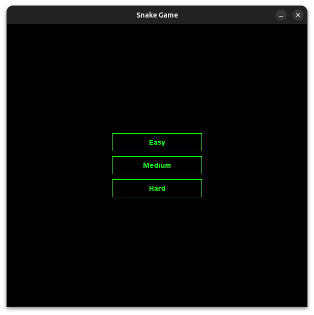

# 🐍 SnakeGame – Java GUI Project

This is a **Snake** game implemented in **Java** using the **Swing GUI** toolkit. The goal of the game is to control the snake, eat apples, and avoid colliding with the walls or itself.

## 📌 Notes

This project was developed as a personal learning experience and is intended to demonstrate proficiency in Java and basic game development techniques. It runs with Java 17+ but may also work on earlier versions.

## 🎮 Features

- Snake movement using arrow keys
- Randomly placed apples
- Multiple difficulty levels (Easy, Medium, Hard)
- Sound effects (eating, collision, etc.)
- Java Swing-based graphical user interface
- Score saving to a `scores.txt` file
- Name input and score logging

## 📁 File Structure

```
SnakeGame/
│
├── clips/              # Sound effects (.wav, .mp3)
├── src/                # Java source files
├── scores.txt          # Score storage file
└── README.md           # This file
```

## ▶️ How to Run

1. **Compile** the Java files:

   ```bash
   javac src/*.java
   ```

2. **Run** the game:
   ```bash
   java -cp src MainApp
   ```

Make sure the `clips` folder and `scores.txt` file are accessible in the working directory when you run the game.

## 🖼️ Screenshots

### Main Menu


### UserName selection


### Gameplay


### Gameover


### Difficulty selection



### Score log


## 🧠 What I Learned

- Building GUIs using Java Swing
- Organizing game logic with OOP principles
- Integrating sound effects
- Managing multiple GUI panels and game states
